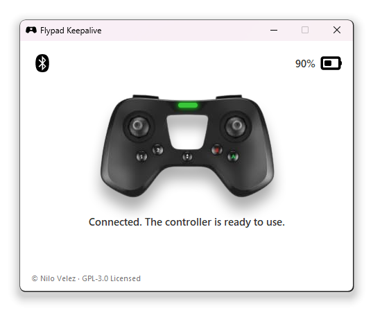
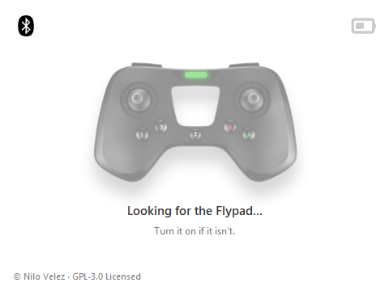
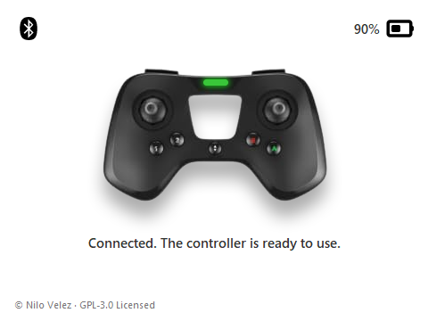
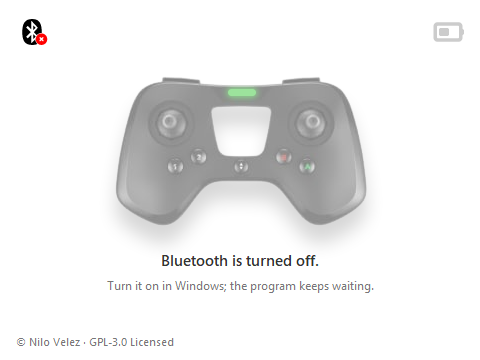
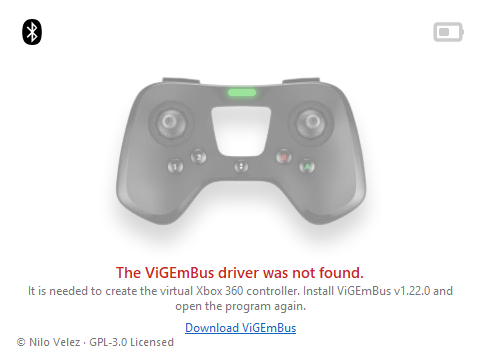

<h1 align="center">Flypad Keepalive</h1>

<p align="center">
  <b>Use your Parrot Flypad as an Xbox 360 controller in PC drone simulators.</b><br>
  Stable Bluetooth connection, no cables, no random disconnects.
</p>

<p align="center">
  
  <a href="https://github.com/nilovelez/flypad-keepalive/releases/latest"></a>
  
</p>

<p align="center">
  
</p>

---

## Why?

The Parrot Flypad is a nice, light Bluetooth controller made for Parrot's
minidrones. Windows recognizes it as a game controller, both over USB and when paired over Bluetooth,
so it looks like it should just work in simulators like **Liftoff** or **Uncrashed**.

It doesn't: **in both cases it disconnects after 60–120 seconds**, which makes it useless for flying.

Flypad Keepalive fixes that. Instead of going through Windows' generic controller support, it talks
to the Flypad directly over Bluetooth Low Energy, the same way Parrot's own app does, which keeps the
connection alive for as long as you play. It then presents the Flypad to Windows as a standard
**Xbox 360 controller**, which every game understands.

Tested in **Uncrashed** for long sessions with no disconnects. Any simulator that supports an Xbox
controller, such as **Liftoff**, works the same way.

## Features

- **Stable connection**: no more drops after a minute or two.
- **Automatic reconnection**: if the Flypad turns off or goes out of range, it is picked up again as
  soon as it comes back.
- **Battery level** always in sight.
- **Clear messages**: tells you when Bluetooth is off, when the driver is missing, and what to do.
- **No pairing needed**: just turn the Flypad on.
- **Single `.exe`**, nothing to install apart from the controller driver.

## Requirements

- **Windows 10 or 11**.
- **Bluetooth 4.0 (Bluetooth LE) or later**. Most laptops have it; on a desktop PC without Bluetooth,
  any USB Bluetooth adapter will do.
- The **ViGEmBus v1.22.0** driver, which creates the virtual Xbox 360 controller. The installer is
  included in this repository (see below).
- A **Parrot Flypad**, of course.

## Installation

### 1. Install the ViGEmBus driver (once)

Download and run [`ViGEmBus_1.22.0_x64_x86_arm64.exe`](https://github.com/nilovelez/flypad-keepalive/raw/main/drivers/ViGEmBus_1.22.0_x64_x86_arm64.exe),
go through the steps and restart if asked to.

ViGEmBus is the open-source driver that lets programs create virtual game controllers. Its author
discontinued it in 2023, but it still works perfectly on Windows 10 and 11; a copy of the official,
signed v1.22.0 installer is kept in [`drivers/`](drivers/) in case the original download ever
disappears. If you already have ViGEmBus installed (it is used by DS4Windows and other tools), you can
skip this step.

### 2. Download Flypad Keepalive

**[Download FlypadKeepalive.exe](https://github.com/nilovelez/flypad-keepalive/releases/latest/download/FlypadKeepalive.exe)**
(latest version) and put it anywhere you like, for example on your desktop. There is nothing to install.

Release notes and checksums are on the [Releases](https://github.com/nilovelez/flypad-keepalive/releases) page.

### 3. The first time: Windows SmartScreen

The first time you open it, Windows may show a blue **"Windows protected your PC"** window. This
happens with any new program that isn't signed with a paid code-signing certificate; it doesn't mean
anything is wrong. Click **More info** and then **Run anyway**. Windows won't ask again.

If you'd rather not trust a downloaded `.exe`, you can [build it yourself](#building-from-source).

## Usage

1. Turn the Flypad on in **Bluetooth mode** (green LED blinking). Make sure it isn't connected to a
   phone or tablet.
2. Open **Flypad Keepalive**. It finds the Flypad on its own and connects to it.
3. Start your simulator and **leave the window open** while you play. Closing it disconnects the
   controller.

The window tells you what is going on at all times:

| | |
|:---:|:---:|
|  |  |
| **Looking for the Flypad.** Turn it on if it isn't. | **Connected.** The controller is ready to use; battery level at the top right. |
|  |  |
| **Bluetooth is off.** Turn it on in Windows; the program keeps waiting and connects as soon as it can. | **Something needs fixing.** Here, the ViGEmBus driver isn't installed. |

> [!TIP]
> To save battery during long sessions, you can plug the Flypad into a USB port **just to charge it**.
> Data keeps going over Bluetooth, so the connection stays stable.

## Button mapping

The Flypad shows up in games as an Xbox 360 controller with this layout:

| Flypad | Xbox 360 controller |
|---|---|
| Left stick | Left stick |
| Right stick | Right stick |
| Press left stick | Left stick click (LS) |
| Press right stick | Right stick click (RS) |
| TAKEOFF | Start |
| 1 | X |
| 2 | Y |
| 3 | B |
| 4 | A |
| L1 | Left bumper (LB) |
| R1 | Right bumper (RB) |
| L2 | Left trigger (LT) |
| R2 | Right trigger (RT) |

L2 and R2 are buttons on the Flypad, so they act as fully pressed or fully released triggers.
Most simulators let you remap everything from their own controls menu.

## Troubleshooting

<details>
<summary><b>It keeps saying "Looking for the Flypad..."</b></summary>

- Check that the Flypad is on and in Bluetooth mode (green LED blinking).
- Make sure it isn't connected to a phone or tablet (FreeFlight or any other app). It can only talk to
  one device at a time.
- If you paired it in **Windows Settings → Bluetooth & devices**, it usually still works, but if it
  doesn't show up, remove it from there and try again.
- Move closer to the PC, or to the USB Bluetooth adapter.
</details>

<details>
<summary><b>"The ViGEmBus driver was not found"</b></summary>

The virtual controller driver isn't installed. Install it from [`drivers/`](drivers/) (see
[Installation](#1-install-the-vigembus-driver-once)), restart if asked to, and open Flypad Keepalive again.
</details>

<details>
<summary><b>"Bluetooth is turned off"</b></summary>

Turn Bluetooth on in Windows (quick settings, or **Settings → Bluetooth & devices**). You don't need to
restart Flypad Keepalive: it connects as soon as Bluetooth is back.
</details>

<details>
<summary><b>"No Bluetooth adapter was found" or "can't connect to Bluetooth LE controllers"</b></summary>

The PC has no Bluetooth, or its adapter doesn't support Bluetooth LE (it needs Bluetooth 4.0 or
later). A cheap USB Bluetooth adapter solves it.
</details>

<details>
<summary><b>It connects, but the game doesn't react to the controller</b></summary>

- Start Flypad Keepalive and wait for **Connected** *before* starting the game; some games only look for
  controllers when they start.
- Check that the game is set to use a gamepad/controller and not keyboard or a different device.
- To check that Windows sees it: press <kbd>Win</kbd>+<kbd>R</kbd>, type `joy.cpl` and press Enter. An
  "Xbox 360 Controller for Windows" should be listed while the Flypad is connected.
</details>

<details>
<summary><b>Why not just connect the Flypad by USB or pair it in Windows?</b></summary>

That's exactly what doesn't work: in both cases Windows sees it as a generic controller and it
disconnects after 60–120 seconds. Flypad Keepalive exists to avoid that. You can still use the USB
cable to charge it while playing.
</details>

<details>
<summary><b>I have more than one Flypad</b></summary>

By default it connects to the first Flypad it finds. To pick one, start it from a command prompt with
its Bluetooth address:

```
FlypadKeepalive.exe --address C6:41:41:93:4B:73
```
</details>

<details>
<summary><b>Windows says "Windows protected your PC"</b></summary>

That's SmartScreen warning about an unsigned program. Click **More info** → **Run anyway**. See
[Installation](#3-the-first-time-windows-smartscreen).
</details>

## How it works

The Flypad is a Bluetooth Low Energy device that sends its state as small 7-byte notifications:
battery level, a 16-bit button mask and the four stick axes. The protocol was worked out from Parrot's
FreeFlight Mini app, which uses the Flypad to fly Parrot's minidrones.

Flypad Keepalive connects to the Flypad's GATT service with [bleak](https://github.com/hbldh/bleak),
subscribes to those notifications and forwards every change to a virtual Xbox 360 controller created
with [vgamepad](https://github.com/yannbouteiller/vgamepad) on top of the
[ViGEmBus](https://github.com/nefarius/ViGEmBus) driver. Because the connection is a direct GATT link
instead of Windows' generic HID handling, it doesn't drop.

## Building from source

You need Windows and Python 3.14 (the version it is developed and tested with).

```powershell
git clone https://github.com/nilovelez/flypad-keepalive.git
cd flypad-keepalive
python -m venv .venv
.venv\Scripts\pip install -r requirements.txt
```

> [!NOTE]
> Installing `vgamepad` with pip may open an installer for an older ViGEmBus version that comes
> bundled with it. You can cancel it and use the v1.22.0 installer in `drivers/` instead.

Run it:

```powershell
.venv\Scripts\python flypad_keepalive.py        # graphical window
.venv\Scripts\python flypad_bridge.py           # console version, prints every event
.venv\Scripts\python flypad_bridge.py --no-gamepad   # diagnostics: print raw frames, no virtual controller
```

Build the single-file `.exe` (output in `dist\FlypadKeepalive.exe`):

```powershell
.\build.ps1
```

## Credits

- [ViGEmBus](https://github.com/nefarius/ViGEmBus) by Nefarius Software Solutions e.U. (BSD 3-Clause),
  the driver behind the virtual controller.
- [bleak](https://github.com/hbldh/bleak) (MIT) for Bluetooth LE.
- [vgamepad](https://github.com/yannbouteiller/vgamepad) (MIT) for the virtual Xbox 360 controller.

Flypad Keepalive is an independent project, not affiliated with or endorsed by Parrot.
Parrot and Flypad are trademarks of their respective owners.

## License

© Nilo Velez. Released under the [GNU General Public License v3.0](LICENSE).

The ViGEmBus installer in [`drivers/`](drivers/) is distributed under its own
[BSD 3-Clause License](drivers/LICENSE-ViGEmBus.txt).
